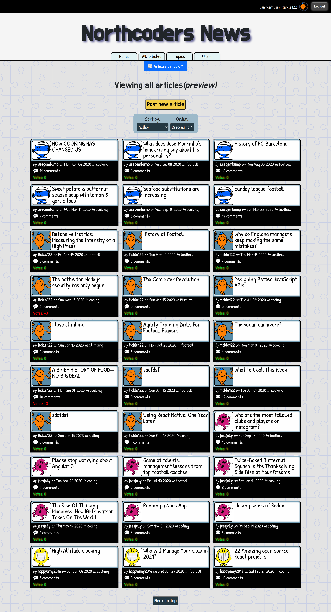

# **Northcoders News**: a front end *React* project

**[Link to my live app](
nc-news-react-app.netlify.app)**

**Northcoders News** is a social news aggregation, web content rating, and discussion website.

Northcoders News has articles which are divided into topics. Each article has user curated ratings and can be up or down voted. Users can also add comments about an article.

## Available Functionality

With this applciation, a user can: 
- view all articles that have been posted;
- filter and sort articles;
- view latest commentss;
- vote up/down on articles and comments;
- post new comments and delete previous comments;
- post new articles and delete previous articles;
- login in using pre-defined user account;
- add and delete topics.

## Preview
 
     
  
