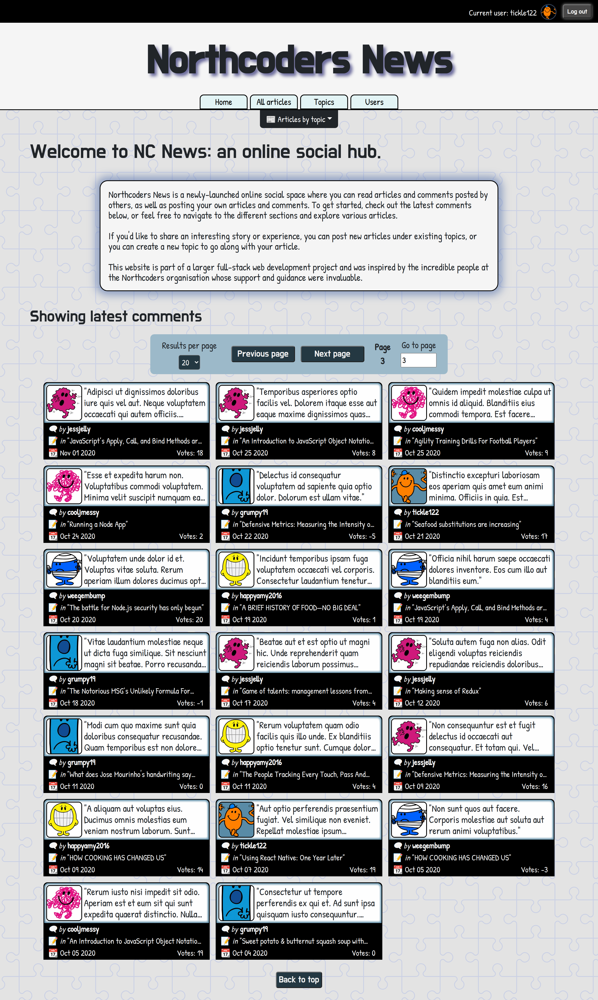
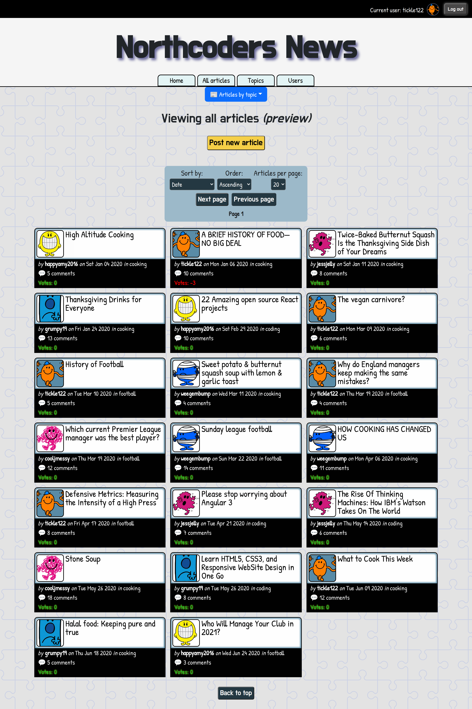
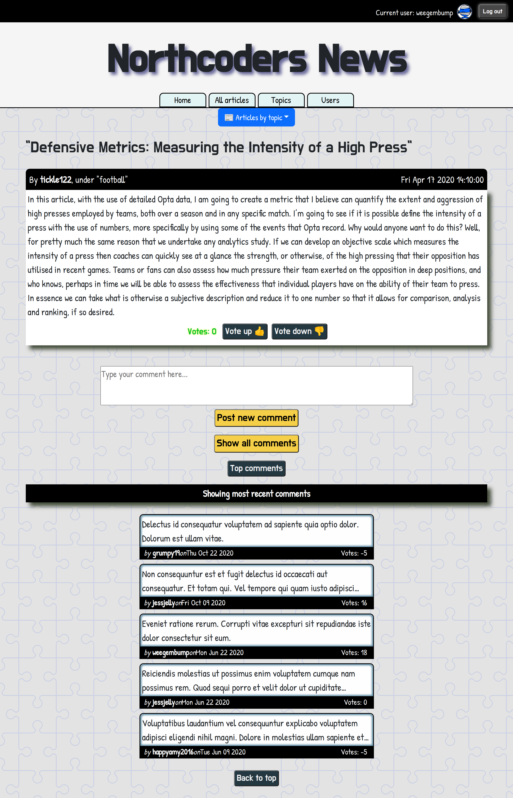
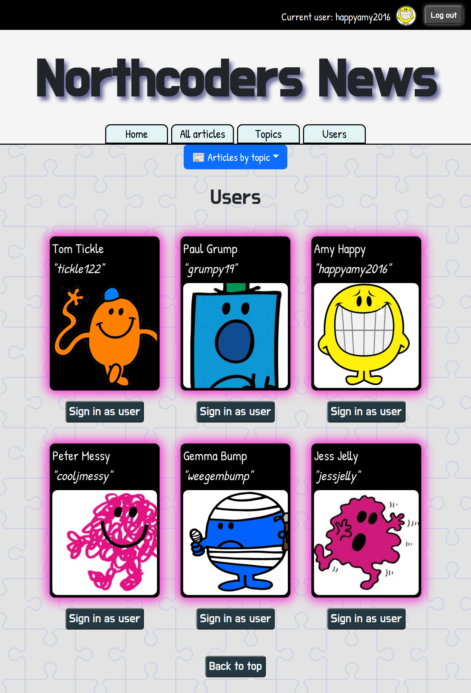
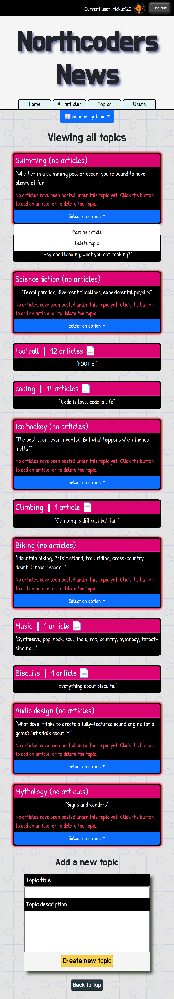
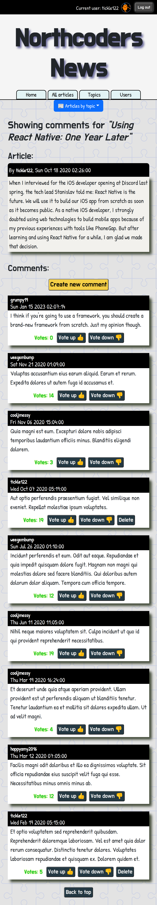

# **Northcoders News**: a front end *React* project

**[Link to my live web app](
nc-news-react-app.netlify.app)**

**Northcoders News** is an online social hub where you can view, rate and post articles and comments under different categories.

The website is linked to a live database and a RESTful back end API that I created using node and express, which exposes a broad range of endpoints to the web app and covers the full range of CRUD operations. The user interface allows for lots of interactivity and offers a rich user experience, through extensive use of conditional rendering, meaningful user interface updates, impactful error handling, appropriate feedback regarding loading states and confirmation of successful submissions.

## Available functionality
**Note**: a lot of the app's functionality requires the user to be signed up and logged in, which can be accomplished very easily and quickly using the signup/login pages.

With this application, a user can: 
- create a new account;
- login to an existing account;
- view all articles that have been posted;
- filter and sort articles;
- view latest comments;
- vote up/down on articles and comments;
- post new comments and delete previous comments;
- post new articles and delete previous articles;
- add and delete topics;
- login in as one of several existing users.
    - To log in manually, use the buttons at the top of the screen and login with the username and 'password'. 
    - Usernames can be found on the 'Users' page.

## Views
### Home page
 
     

### Articles
  
     

### Single article view
  
     

### Users
  
     

### Topics
  
     

### Comments
  
